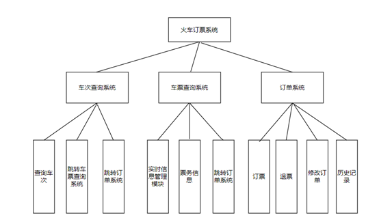

# 基于Oracle的火车票代售系统数据库设计

### 成都大学信息科学与工程学院

| 学号         | 班级         | 姓名   | 照片 |
| ------------ | ------------ | ------ | ---- |
| 201810414412 | 软件(本)18-4 | 黄海峰 |      |

## 1. 概述

- 基于GitHub的实验管理平台的作用是在线管理实验成绩的Web应用系统。学生和老师的实验内容均存放在GitHUB
  页面上。
- 对车次信息进行添加、删除操作。列车时间信息：对列车时间信息进行添加、删除操作。
- 座位信息：对座位信息进行添加、删除操作。
- 价格信息：对价格信息进行添加、删除操作。车站信息：对车站信息进行添加、删除操作。
- 票务系统由于很强的实时性，必须添加实时信息管理模块，显示票务信息，然后跳转订单系统。
- 订单系统提供订票退票还有修改订单的操作，历史记录可供查看。

## 2. 系统总体结构

## 3. 用例图设计

## 4. 类图设计

## 5. 数据库设计

- ### [参见数据库设计](./数据库设计.md)

## 6. 用例及界面详细设计

#### [用例规约](./用例规约.docx)

